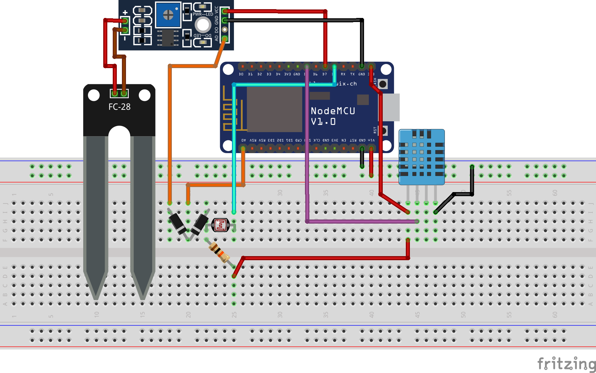

## Objetivo

O objetivo desse trabalho é apresentar um sistema de monitoramento de variáveis de ambiente como temperatura, humidade, luminosidade, ponto de orvalho, e etc, utilizando dipositivos e plataformas com suporte a IoT.

### Motivação

O monitoramento de variáveis de ambiente é algo presente em diversas áreas, desde ao monitoramento para automação até a um controle mais preciso prar fins de pesquisa científica.

Com a disseminação do IoT agora é possivel que exista um monitoramento e uma tomada de decisões em um tempo bem menor ou até mesmo em tempo real. Dessa forma, esse projeto tem o objetivo de mostrar que é possível ter um sistema de monitoramento sem necessitar de um investimento muito grande.

## Materiais

### Software

Descrição | Versão
------------ | -------------
[Arduino IDE](https://www.arduino.cc/)  |   1.8.5
[Thinkspeak](https://thingspeak.com/)   |   -
[Ionic](https://ionicframework.com/)    |   2 

#### Bibliotecas

Antes de realizar a instalação das bibliotecas é necessário adicionar um novo repositório de busca na IDE do Arduino. Isso pode ser feito adicionando o endereço `http://arduino.esp8266.com/stable/package_esp8266com_index.json` ao campo **URLs adicionais para Gerenciadores de Placas** localizado em **Arquivo > Preferências**. Dessa forma, o gerenciador de biblioteca da IDE do Arduino é capaz de localizar e instalar todas as bibliotecas necessárias para o projeto.

Para que o programa seja compilado e gravado no ESP de maneira correta é necessário realizar a instalação das seguintes bibliotecas:

Descrição | Versão
------------ | -------------
ESP8266*  |   1.0.0
DHT Sensor Library | 1.3.0

#### Preparação da API Thinkspeak

Para o armazenamento e comunicação com os dispositivos, foi utilizado o serviço ***ThinkSpeak***, uma plataforma aberta para IoT, que permite a criação de API para comunicação entre dispositivos através da nuvem. Para fazer uso da plataforma ***ThinkSpeak*** é necessário registrar-se no [link](https://thingspeak.com).

Após realizado o cadastro no ***ThinkSpeak*** são necessários os seguintes passos para criação de uma API para sua aplicação:

1. Crie um novo canal nesse [link](https://thingspeak.com/channels), para configurar e habilitar os campos existentes nas suas requisições.
2. Teste as requisições de acordo com o formato indicado após a criação do canal.

Após a criação do canal, são geradas duas chaves: (i) uma chave para escrita, que é usada para escrever os dados e realizar updates; (ii) uma chave de leitura, que é utilizada nas consultas.

A própria API do ThinkSpeak fornece as URLs de exemplo utilizando as chaves de escrita e leitura, um exemplo dessas URL pode ser visto abaixo:

```
// Atualiza o valor de um campo
GET https://api.thingspeak.com/update?api_key=I4CNQBYEG6HGFMEV&field1=0
// Retorna o resultado de um canal inteiro
GET https://api.thingspeak.com/channels/369399/feeds.json?api_key=39YJM4SS4Q8ZCZT0&results=2
// Retorna o resultado de um campo em especifico
GET https://api.thingspeak.com/channels/369399/fields/1.json?api_key=39YJM4SS4Q8ZCZT0&results=2
// Retorna as informaçoes sobre o estado de um canal
GET https://api.thingspeak.com/channels/369399/status.json?api_key=39YJM4SS4Q8ZCZT0
```

### Hardware

Qtd | Descrição | Preço Médio
------------ | ------------- | -------------
1   |   [ESP8266 nodemcu](https://www.filipeflop.com/blog/esp8266-nodemcu-como-programar/)  | R$ 28,00
1   |   Protoboard | R$ 4,00
1   |   [Sensor de temperatura e umidade DHT11](https://akizukidenshi.com/download/ds/aosong/DHT11.pdf) | R$ 7,00
1   |   Sensor de umidade do Solo YL-69 + YL-38| R$ 8,00
1   |   Sensor de luminosidade LDR | R$ 4,00 (10un)
1   |   Resistor de 10k ohms       | R$ 0,50
2   |   Diodos (?)                 | R$ 0,70

> Mais sensores podem ser adicionados e monitorados através da configuração do ESP e da adição de novos campos na API do [*Thinkspeak*](https://thingspeak.com).

#### Esquema de montagem

A imagem abaixo mostra o esquema de montagem utilizado no projeto.



## Passos para Execução

Uma vez instalado o programa, juntamente com as depencias de bibliotecas, basta clicar em **Compilar e executar** para que o código seja compilado e inserido no **NodeMCU**.

## Passos para Adição de outros sensores

### Modificações no ThinkSpeak

Para adicionar um novo campo na API do ThinkSpeak basta acessar a url `https://thingspeak.com/channels/<id_canal>/edit` onde **id_canal** é o id do canal gerado na criação do  canal.

Nesse momento basta apenas habilitar e nomear um dos 8 campos possíveis fornecidos pela API do ThinkSpeak.

### Modificações no código do ESP

No código do ESP também não são necessárias grandes modificações. Após feita a ativação e leitura do novo sensor, basta apenas que valor lido seja adicionado a URL de update da API justatamente com o nome do respectivo campo. Como no código abaixo, onde **t** e **h** são variaveis que guardam os valores lidos de dois sensores.
```
String url = "/update";
  url += "?api_key=";
  url += apiKey;
  url +="&field1=";
  url += String(t);
  url +="&field2=";
  url += String(h);
  url +="&field3=";
  url += String(dp);
```

## Exemplo em funcionamento



## Problemas e Soluções

#### Problemas com protocolo HTTPS?

Como o serviço do ThinkSpeak funciona sobre o protocolo HTTPS é necessário que o ESP também tenha suporte para HTTPS. Dessa forma foi necessária a utilização da biblioteca **<WiFiClientSecure.h>**.

#### Problemas com precisão dos sensores?

Os sensores utilizados não são de alta precisão mas, para efeitos de prototipação, mostraram-se suficientemente bons e com uma variação de 20% com relação as medições feitas por estações profissionais.

